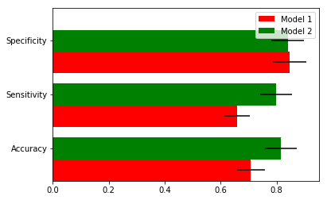

# Predicting growth rate of reddit post.

# Introduction

The focus of this project is to predict if a reddit post will be above or below of a certain meaningful statistic. In essence is a regression problem but for the sake of simplicity it has been reduced to a classification problem. What kind of insight can be derived from this approach?

# First step: Web scrapping
First things first, I started by exploring the web site(reddit) with my browser (google chrome). After a breve exploration, I created functions to extract what will be the features of my dataset. A snippet of code for one of those function looks like this:
```
def extract_subreddit_from_result(result):
    a=result.find('a',{'class':"subreddit hover may-blank"})
    return a.text if a else None
```
Before to proceed to the actual web scrapping make sure to read the site ToS (terms of service) to avoid denial of service or unresponsiveness, due in part because the site may take the web scrapping as an attack on the site. Also look for additional resources like APIs or AWS wrappers. After you make sure the you that you code won’t be see as an attack you can run the code. The code I use to extract the data was the following:
```
import time
max_resluts=1000
counter = 0
url="http://www.reddit.com"
data={'title':[],'submitted':[],'comments':[],'subreddit':[]}
for n in range(0,max_resluts):
#     print(response.status_code)
    if response.status_code==200:    
        html=response.text
        soup = BeautifulSoup(html,'lxml')        
        for item in soup.find_all('div',{'class':"top-matter"}):
            data['title'].append(extract_title_from_result(item) )
            data['submitted'].append(extract_submitted_from_result(item) )
            data['comments'].append(extract_comments_from_result(item) )
            data['subreddit'].append(extract_subreddit_from_result(item))
        
        url=get_next_url(soup)
        if(len(data['title'])%100  == 0):
            print('now have',len(data['title']),'rows')
    else:
        if(counter % 10 == 0):
            print(counter,'failed attempts')
        counter += 1
    time.sleep(3)
dataset=pd.DataFrame(data)
dataset.head(8) 
```
# Saving your data
After a successful run the next step will be saving the dataset.                                                                                                                                                                                                                                   ```
import os                                                                       
file_path='C:\\Users\\mypath'   
dataset.to_csv(os.path.join(file_path,'redditscrap5.csv'),encoding='utf-8-sig',index=False)                                                                     ```

# Start the EDA process

Although the sample is large enough never forget that this is sampling a very large “population” in order to make inferences on the nature of the population. Let see how it looks the probability density of the target variable (number of comments) looks like:


# Information obtained through EDA

Large range of the target variable, going from 2 comments up to 2000 and more comments. 

The splitting statistic choose was the geometric mean, which is at measuring of compounding factors and growth acceleration.

# Building models 
Model one was constructed using only the subreddit and time since posted.

Model two has additional features, all of them derived from NPL.

# Comparing models
The only difference between the models was the features employed, both models are random forest which were tuned and cross validated as well.



It is clear the model one outperformed model two.

# Versioning

We use SemVer for versioning. For the versions available, see the tags on this repository..

# License

This project is licensed under the Apache 2.0 License - see the LICENSE.md file for details.

# Acknowledgments
•	Although NLP seems it didn’t work for this specific instance, is something to keep exploring in the future.

•	For a more explanations refer to the power point presentation on the repo.

•	This was a student project, but it has potential to be commercial tool with some modifications. See the Jupyter notebook   [a relative link](reddit_post_growth_project.ipynb) for more details.


